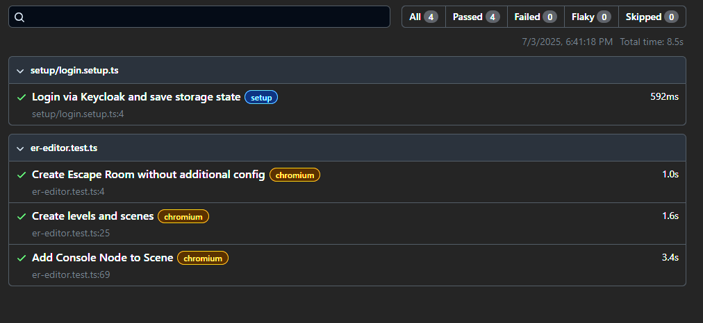

# Thomas Winter - Escape Room Editor Tests

## Verwendete Werkzeuge
Für die Frontend-Tests wurde [`Playwright`](https://playwright.dev/) verwendet. Dabei wurde zuerst ein setup file erstellt,
welches für jeden nachfolgenden Test automatisch die Authentication durchführt.

Danach wurde ein Großteil der Tests mittels `npx playwright codegen` über einen click-and-record Ansatz erstellt.

Kleine Änderungen wurden nach den initial erstellten Strukturen vorgenommen um z.B. URLs dynamischer zu verlinken oder
wiederverwendete Inputs wurden als Variablen abgelegt.

Die Tests wurden sequentiell abgearbeitet da sie aufeinander aufbauen. Der Vollständigkeit ist neben den Testfällen auch
die Playwright.config hinterlegt

## Playwrigth Test Report 


## Setup File
<details>

<summary>Login via Keycloak and save storage state</summary>

```TypeScript
import { test as setup } from '@playwright/test';
import {LECTOR_PORTAL_APP_PATHS} from "@/app/constants/paths.ts";

setup('Login via Keycloak and save storage state', async ({ page }) => {

    await page.goto(LECTOR_PORTAL_APP_PATHS.DASHBOARD ?? "");

    // Keycloak Login Page
    await page.getByRole('textbox', { name: 'Username or email' }).click();
    await page.getByRole('textbox', { name: 'Username or email' }).fill('Spodo');
    await page.getByRole('textbox', { name: 'Username or email' }).press('Tab');

    await page.getByRole('textbox', { name: 'Password' }).fill('Spodo');
    await page.getByRole('button', { name: 'Sign In' }).click();

    await page.waitForURL(LECTOR_PORTAL_APP_PATHS.DASHBOARD);

    await page.context().storageState({ path: 'playwright/.auth/user.json' });
});

```
</details>

## Testcases Textuell
<details>
<summary>Create Escape Room without additional config</summary>

```TypeScript
test('Create Escape Room without additional config', async ({ page }) => {
    await page.goto(LECTOR_PORTAL_APP_PATHS.DASHBOARD);

    const descText = 'Spukhaus mit versteckten Hinweisen'

    await page.getByRole('button', { name: 'Create new template' }).click();
    await page.getByRole('textbox', { name: 'Name' }).click();
    await page.getByRole('textbox', { name: 'Name' }).fill('Geistervilla');

    await page.getByRole('textbox', { name: 'Description' }).click();
    await page.getByRole('textbox', { name: 'Description' }).fill(descText);

    await page.getByRole('button', { name: 'Create' }).click();
    await page.getByRole('button', { name: 'Leave' }).click();
    await page.getByRole('button', { name: 'View Templates' }).click();

    const createdRoom = page.getByRole('heading', { name: 'Geistervilla' })

    expect(createdRoom.isVisible()).toBeTruthy()
});
```
</details>

<details>
<summary>Create levels and scenes</summary>

```TypeScript
test('Create levels and scenes', async ({ page }) => {
    await page.goto(LECTOR_PORTAL_APP_PATHS.TEMPLATE_VIEW);

    const toEdit = page.getByRole('button').filter({ hasText: /^$/ }).nth(1)
    await toEdit.first().click()

    await page.getByRole('button', { name: 'Add Level' }).click();
    await page.getByRole('heading', { name: 'New level' }).first().dblclick();
    await page.getByRole('textbox').press('ControlOrMeta+a');
    await page.getByRole('textbox').fill('Level 1');
    await page.getByRole('textbox').press('Enter');

    await page.getByRole('button', { name: 'Add Level' }).click();
    await page.getByRole('heading', { name: 'New level' }).dblclick();
    await page.getByRole('textbox').press('ControlOrMeta+a');
    await page.getByRole('textbox').fill('Level 2');
    await page.getByRole('textbox').press('Enter');

    await page.getByRole('button', { name: 'Add Scene' }).first().click();
    await page.getByRole('button', { name: 'New Scene' }).dblclick();
    await page.getByRole('textbox').press('ControlOrMeta+a');
    await page.getByRole('textbox').fill('Scene 1');
    await page.getByRole('textbox').press('Enter');

    await page.getByRole('button', { name: 'Add Scene' }).first().click();
    await page.getByRole('button', { name: 'New Scene' }).dblclick();
    await page.getByRole('textbox').press('ControlOrMeta+a');
    await page.getByRole('textbox').fill('Scene 2');
    await page.getByRole('textbox').press('Enter');

    await page.getByRole('button', { name: 'Add Scene' }).nth(1).click();
    await page.getByRole('button', { name: 'New Scene' }).dblclick();
    await page.getByRole('textbox').press('ControlOrMeta+a');
    await page.getByRole('textbox').fill('Scene 1');
    await page.getByRole('textbox').press('Enter');

    await page.getByRole('button', { name: 'Save' }).click();

    await expect(page.locator('body')).toContainText('Level 1');
    await expect(page.locator('body')).toContainText('Scene 1');
    await expect(page.locator('body')).toContainText('Scene 2');
    await expect(page.locator('body')).toContainText('Level 2');
})
```
</details>

<details>
<summary>Add Console Node to Scene</summary>

```TypeScript
test('Add Console Node to Scene', async ({ page }) => {
    await page.goto(LECTOR_PORTAL_APP_PATHS.TEMPLATE_VIEW);

    const toEdit = page.getByRole('button').filter({ hasText: /^$/ }).nth(1)
    await toEdit.first().click()

    await page.getByRole('heading', { name: 'Click to add image' }).click();
    await page.getByRole('button', { name: 'Click to add image' }).setInputFiles("./tests/resources/spooky-tree.jpg");

    const droppable = page.getByRole('img', { name: 'Scene Background' })
    const droppableBox = await droppable.boundingBox()

    if (!droppableBox?.x || !droppableBox?.y) throw new Error("Droppable box not found!");
    console.log('DroppableCoords: ', droppableBox.x, droppableBox.y)

    await page.locator('.p-2 > button:nth-child(2)')
        .dragTo(droppable, {
            targetPosition: {
                x: 50,
                y: 50,
            },
            force: true,
            timeout: 3000,
            trial: false
        })

    await page.waitForTimeout(500);

    await page.locator('.p-2 > button:nth-child(2)').click();
    await page.getByRole('textbox', { name: 'Title' }).click();
    await page.getByRole('textbox', { name: 'Title' }).fill('Test Input');
    await page.getByRole('textbox', { name: 'Title' }).press('Tab');

    await page.getByRole('textbox', { name: 'Description', exact: true }).fill('Test Description');
    await page.getByRole('textbox', { name: 'Description', exact: true }).press('Tab');

    await page.getByRole('textbox', { name: 'Return description' }).fill('Return Desc');
    await page.getByRole('textbox', { name: 'Return description' }).press('Tab');

    await page.getByRole('textbox', { name: 'Constraints' }).fill('Constraints');
    await page.getByRole('textbox', { name: 'Constraints' }).press('Tab');

    await page.getByRole('textbox', { name: 'Example' }).fill('Example');
    await page.getByRole('button', { name: 'Save' }).click();

    await expect(page.getByRole('textbox', { name: 'Title' })).toHaveValue('Test Input');
    await expect(page.getByRole('textbox', { name: 'Description', exact: true })).toHaveValue('Test Description');
    await expect(page.getByRole('textbox', { name: 'Return description' })).toHaveValue('Return Desc');
    await expect(page.getByRole('textbox', { name: 'Constraints' })).toHaveValue('Constraints');
    await expect(page.getByRole('textbox', { name: 'Example' })).toHaveValue('Example');
})
```
</details>

## Playwrigth.config

<details>
<summary>Playwright Config</summary>

```TypeScript
import {defineConfig, devices} from '@playwright/test';
import dotenv from 'dotenv';

/**
* Read environment variables from file.
* https://github.com/motdotla/dotenv
  */
  // import dotenv from 'dotenv';
  // import path from 'path';
  // dotenv.config({ path: path.resolve(__dirname, '.env') });
  dotenv.config({path: '.env.development'});

/**
* See https://playwright.dev/docs/test-configuration.
  */
  export default defineConfig({
  testDir: './tests',
  /* Run tests in files in parallel */
  fullyParallel: false,
  /* Fail the build on CI if you accidentally left test.only in the source code. */
  forbidOnly: !!process.env.CI,
  /* Override default timeout */
  timeout: 15_000,
  /* Retry on CI only */
  retries: process.env.CI ? 2 : 0,
  /* Opt out of parallel tests on CI. */
  workers: process.env.CI ? 1 : undefined,
  /* Reporter to use. See https://playwright.dev/docs/test-reporters */
  reporter: 'html',
  /* Shared settings for all the projects below. See https://playwright.dev/docs/api/class-testoptions. */
  use: {
  /* Base URL to use in actions like `await page.goto('/')`. */
  baseURL: process.env.NEXT_PUBLIC_WEB_URL,

       /* Collect trace when retrying the failed test. See https://playwright.dev/docs/trace-viewer */
       trace: 'on-first-retry',
  },

  /* Configure projects for major browsers */
  projects: [
  {
  name: 'setup',
  testMatch: /.*\.setup\.ts/
  },
  {
  name: 'chromium',
  use: {
  ...devices['Desktop Chrome'],
  storageState: 'playwright/.auth/user.json'
  },
  dependencies: ['setup'],
  },
  ],

  // Run your local dev server before starting the tests
  webServer: {
  command: 'pnpm run dev',
  url: process.env.NEXT_PUBLIC_WEB_URL,
  reuseExistingServer: !process.env.CI,
  },
  });
```

</details>